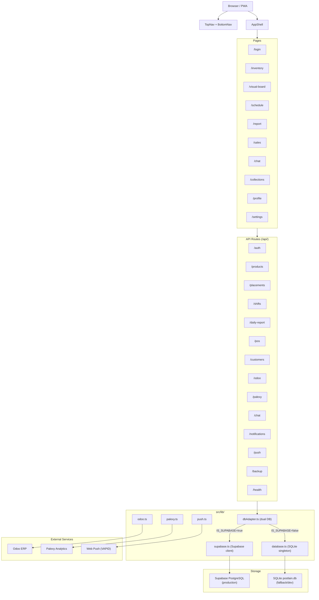
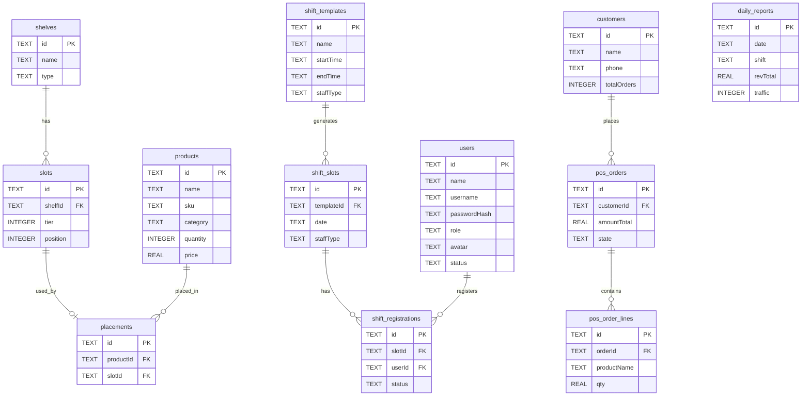
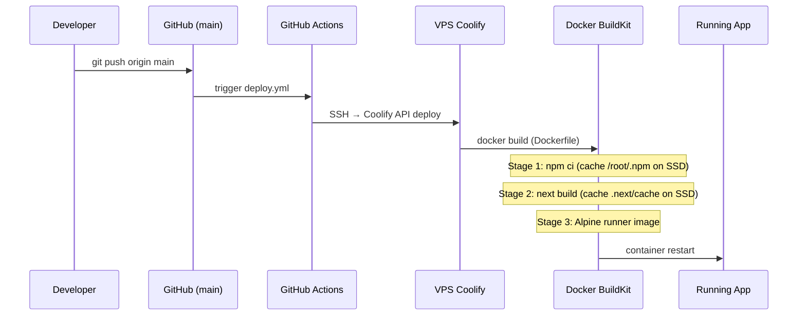

# Postlain Store Manager — Architecture

## Stack
- **Frontend**: Next.js 15 (App Router) + React 19 + Tailwind CSS
- **Backend**: Next.js API Routes (server-side)
- **DB Primary**: Supabase PostgreSQL (`IS_SUPABASE=true` when env vars set)
- **DB Fallback**: SQLite via `better-sqlite3` (local dev)
- **Deploy**: Docker → Coolify on VPS (103.90.224.59)
- **Data Sync**: Odoo ERP + Palexy analytics

---

## Data Flow

---

## Database Tables

---

## Deploy Pipeline

---

## Key Rules (for AI assistant)

- **DB writes**: always go through `dbAdapter.ts` — never call `database.ts` or `supabase.ts` directly from API routes
- **IS_SUPABASE**: production always `true` (Coolify has Supabase env vars set)
- **staffType**: column exists on `shift_templates` and `shift_slots` in Supabase
- **camelCase**: Supabase PostgREST may return snake_case — use normalizer functions `sbRowToTemplate()` / `sbRowToSlot()` in dbAdapter
- **No postgres package**: use `@supabase/supabase-js` for all Supabase operations
- **Data volume**: `/app/data` mounted in Coolify for SQLite persistence
- **Native modules**: `better-sqlite3` built on Debian, copied to Alpine runner
